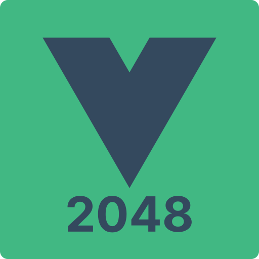

  

  A 2048 Game Clone written in Vue with Multiplayer support!

# Vue 2048
A clone of the popular [2048 Game](https://play2048.co/) written in Vue with support for Multiplayer.

[2048.wheatjs.me](https://2048.wheatjs.me)

## Development Setup

- Install [Node.js](https://nodejs.org/en/) >=v16 and [pnpm](https://pnpm.io/)
- Run `pnpm install`
- Run `pnpm dev` and visit `http://localhost:5173`

## Tech Stack
- Vue
- Vite
- VueUse
- UnoCSS
- PeerJS
- Pinia

## License

[MIT](./LICENSE) License © 2022-PRESENT [Jacob Clevenger](https://github.com/wheatjs)
